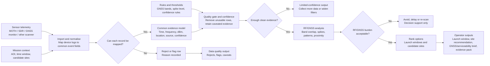

# LANTERN Sensor-Agnostic Data Flow

Purpose: simple patent-advisor diagram showing inputs, outputs, processes and the main decision points.

## Diagram

## Inputs

| Input | Basic detail |
| --- | --- |
| Sensor telemetry | RF/GNSS events from MOTH, SDR receiver, GNSS monitor or another compatible scanner. |
| Mission context | Area of interest, time window, selected collections and candidate sites. |
| Rules and thresholds | GNSS band definitions, spike threshold, quality rules and confidence rules. |

## Processes

| Process | Basic detail |
| --- | --- |
| Import and normalise | Convert device-specific logs into one common evidence model. |
| Quality gate and confidence | Reject unusable records, flag suspect records and calculate confidence. |
| RF/GNSS analysis | Check GNSS-band overlap, strong RF spikes, persistence, timing and location proximity. |
| Rank options | Rank launch windows and candidate sites using retained evidence and confidence. |
| Generate outputs | Produce a caveated operator brief and evidence pack. |

## Decision Points

| Decision point | Yes path | No path |
| --- | --- | --- |
| Can each record be mapped? | Store in common evidence model. | Reject or flag row and record the reason. |
| Enough clean evidence? | Continue to RF/GNSS analysis. | Produce limited-confidence output and recommend more data or wider filters. |
| RF/GNSS burden acceptable? | Rank launch windows and candidate sites. | Recommend avoid, delay, re-scan or validate before use. |

## Outputs

| Output | Basic detail |
| --- | --- |
| Data quality output | Counts of accepted, rejected and flagged records with reasons. |
| Launch-window recommendation | Ranked time windows with caveats and confidence. |
| Candidate-site recommendation | Ranked antenna or operating locations with supporting evidence. |
| GNSS/serviceability brief | RF/GNSS burden summary and validation caveats. |
| Evidence pack | Traceable source, assumptions, decision status and caveats for review. |

## Boundary Statement

LANTERN provides decision support only. It does not authorise flight, certify GNSS integrity, guarantee communications performance or attribute interference to a source.
